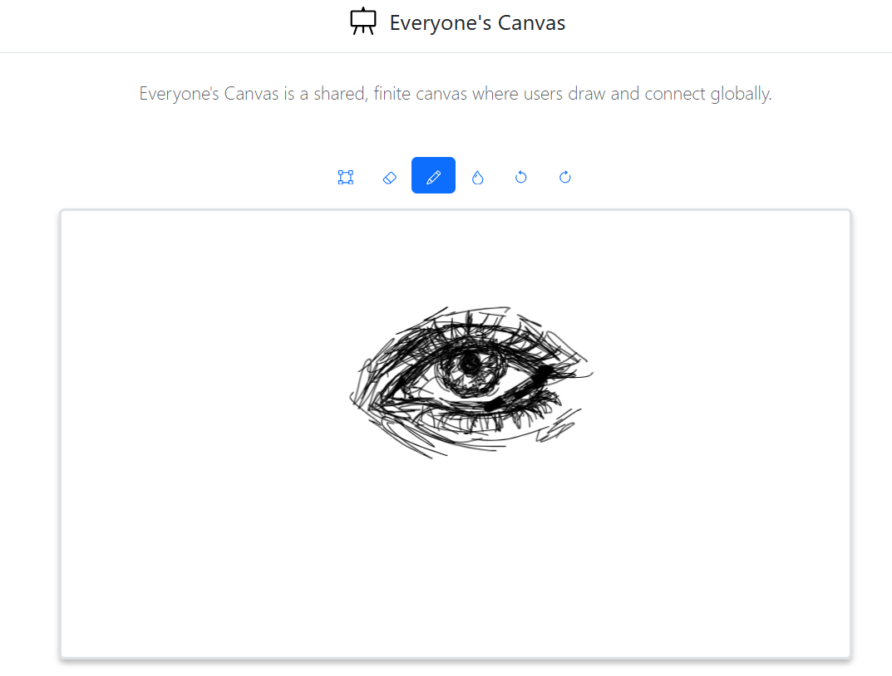

# Everyone's Canvas

 

<div align="center">


   
[Try it Now](draw.mom)

</div>

**Everyone's Canvas** is a real-time, collaborative drawing web application where users from around the world can draw, doodle, and share ideas on a shared, finite canvas. Built with Node.js, Express, and Fabric.js, this project offers a simple yet powerful platform for creative collaboration—no registration required!

---

## Features

- **Collaborative Drawing**: Draw, erase, and edit on a shared canvas with others in real-time.
- **Finite Canvas**: Work within a fixed 854x480 pixel space for a focused experience.
- **Drawing Tools**: Includes pencil, spray, eraser, undo/redo, and selection tools.
- **Customizable Brushes**: Adjust brush width for drawing, erasing, and spraying.
- **Save & Load**: Persist canvas state to the server and load it on startup.
- **Responsive Design**: Built with Bootstrap for a clean, mobile-friendly interface.
- **No Sign-Up Needed**: Jump right in and start drawing!

---

## Demo

(Insert a GIF or screenshot of the app in action here, e.g., using a tool like GIPHY or a screenshot uploaded to the repo.)

---

## Installation

Follow these steps to set up "Everyone's Canvas" locally:

### Prerequisites
- [Node.js](https://nodejs.org/) (v14 or higher)
- [npm](https://www.npmjs.com/) (comes with Node.js)

### Steps
1. **Clone the Repository**:
   ```bash
   git clone https://github.com/ikwbb/everyones-canvas.git
   cd everyones-canvas
   ```

2. **Install Dependencies**:
   ```bash
   npm install
   ```

3. **Start the Server**:
   ```bash
   npm start
   ```
   The app will run on `http://localhost:8080`.

4. **(Optional) Development Mode**:
   Use `nodemon` for automatic server restarts during development:
   ```bash
   npm install -g nodemon
   npm run dev
   ```

---

## Usage

1. Open your browser and navigate to `http://localhost:8080`.
2. Use the toolbar to:
   - **Select**: Move or adjust objects.
   - **Draw**: Freehand drawing with a pencil brush.
   - **Spray**: Spray paint effect.
   - **Erase**: Remove parts of the drawing (toggle "Erase by stroke" for precision).
   - **Undo/Redo**: Step back or forward through your actions.
3. Adjust brush widths via sliders in the collapsible options.
4. Click **Save** to store the canvas state on the server.
5. Refresh the page to load the latest saved canvas.

---

## File Structure

```
everyones-canvas/
├── /client-side/         # Client-side assets
│   ├── index.html        # Main HTML file
│   ├── script.js         # Fabric.js logic for canvas interaction
│   └── style.css         # Custom styles (optional, create if needed)
├── /data/                # Persistent data storage
│   └── canvas-data.json  # Saved canvas state
├── /server/              # Backend server code
│   └── server.js         # Express server
├── .gitignore            # Files to ignore in Git
├── package.json          # Project metadata and dependencies
├── package-lock.json     # Dependency lock file
└── README.md             # This file
```

---

## Dependencies

- **Backend**:
  - [Express](https://expressjs.com/): Web framework for Node.js.
  - [Fabric.js](http://fabricjs.com/): Canvas manipulation library.
- **Frontend**:
  - [Bootstrap 5](https://getbootstrap.com/): Responsive UI framework.
  - [Fabric.js](http://fabricjs.com/): Client-side canvas rendering.

Run `npm install` to install all dependencies listed in `package.json`.

---

## API Endpoints

| Endpoint         | Method | Description                           | Request Body                     | Response                     |
|------------------|--------|---------------------------------------|----------------------------------|------------------------------|
| `/save-data`     | POST   | Saves canvas data to the server       | `{ "canvas": <FabricJSON> }`    | `{ "message": "..." }`       |
| `/load-data`     | GET    | Retrieves saved canvas data           | None                            | `<FabricJSON>`               |
| `/render-img`    | GET    | Renders canvas as a PNG image         | None                            | PNG image stream             |
| `/`              | GET    | Serves the main HTML page             | None                            | `index.html`                 |

---

## Contributing

Contributions are welcome! To contribute:

1. Fork the repository.
2. Create a new branch (`git checkout -b feature/your-feature`).
3. Make your changes and commit (`git commit -m "Add your feature"`).
4. Push to your branch (`git push origin feature/your-feature`).
5. Open a Pull Request.

Please ensure your code follows the existing style and includes appropriate comments.


## Future Enhancements

- Add WebSocket support for real-time collaboration.
- Implement user sessions or rooms for multiple canvases.
- Enhance security with authentication and input validation.
- Add color pickers and more drawing tools.

---

## Contact

Have questions or suggestions? Feel free to open an issue!

Happy drawing! 🎨
